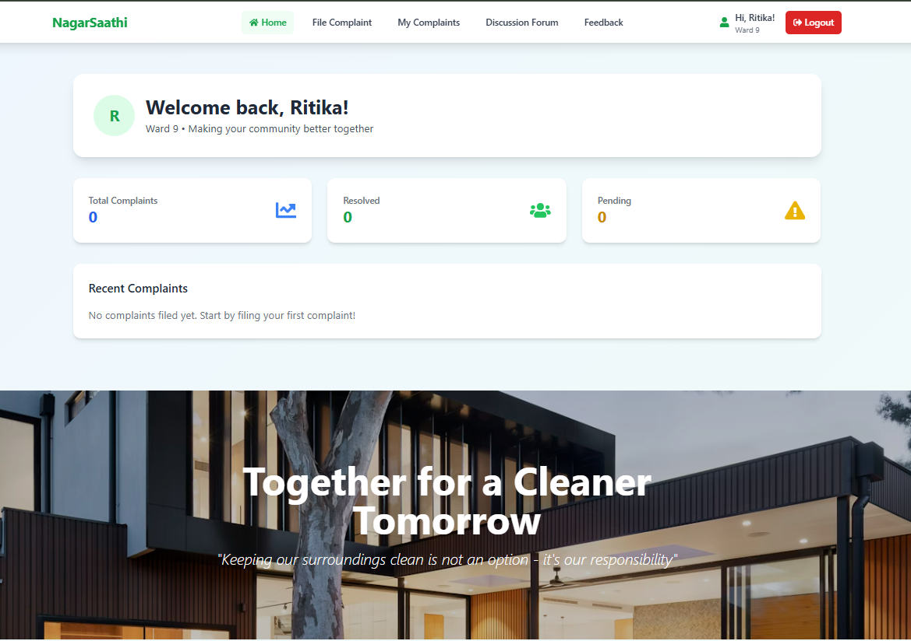
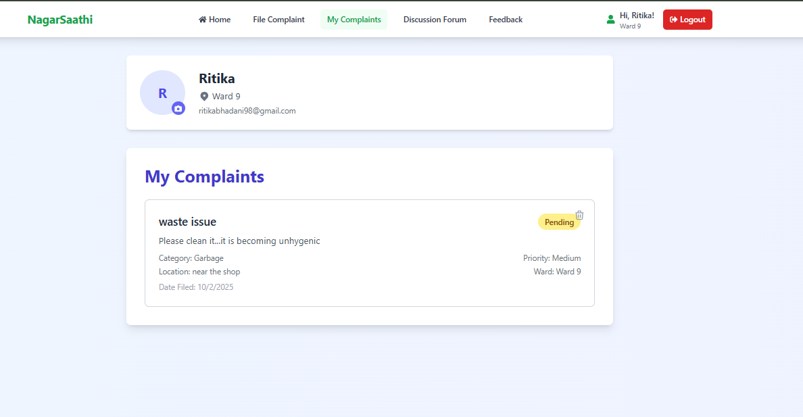
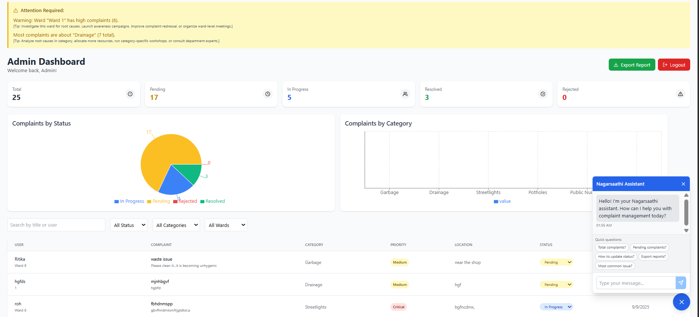
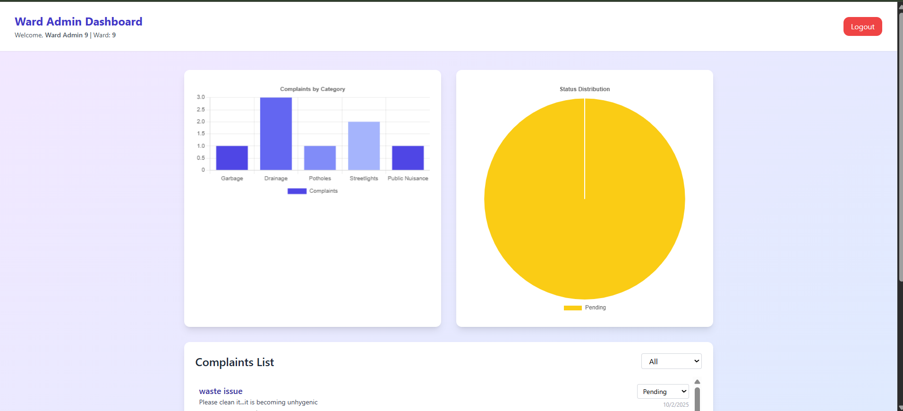
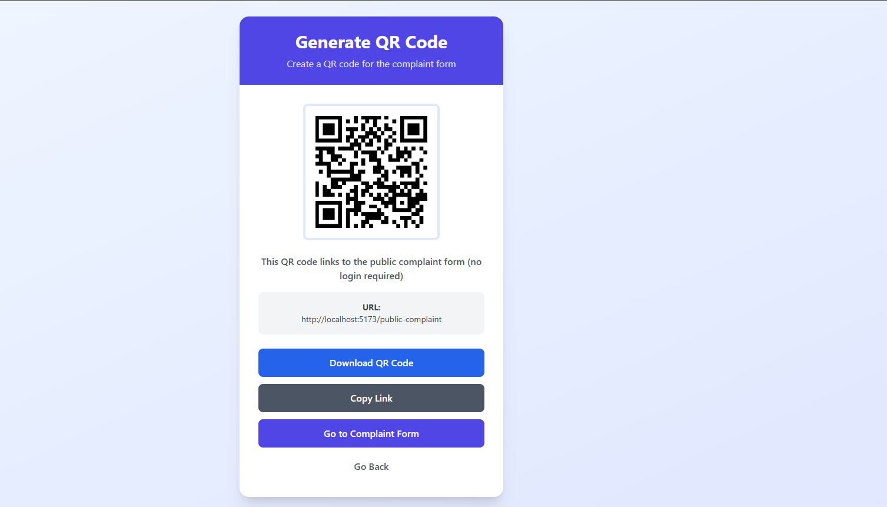
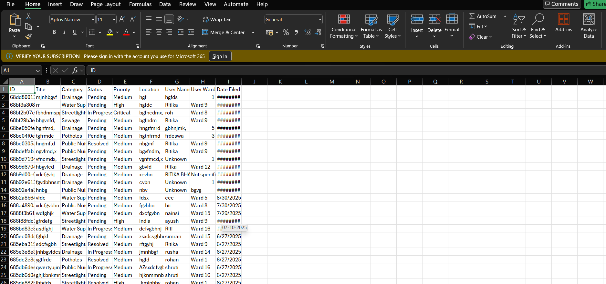

# NagarSaathi

> Smart Municipal Grievance Management Platform

## 📸 Project Screenshots

### Homepage

### Complaints Page

### Main Admin Dashboard

### Ward Admin Dashboard

### QR Functionality

### Complaints Excel Sheet

## 📋 Project Description

**NagarTrack** is a smart municipal grievance management platform that empowers citizens to seamlessly report civic issues like garbage, drainage, potholes, and streetlight failures. With real-time status tracking, data analytics, and ward-wise dashboards, it bridges the gap between the public and local authorities—ensuring faster resolution, improved transparency, and a cleaner, more responsive city.

## 🚀 Features

- **Citizen Issue Reporting**
- **Real-time Status Tracking** 
- **Ward-wise Analytics**
- **Admin Dashboard**
- **QR Code Functionality**
- **Excel Export Capabilities**