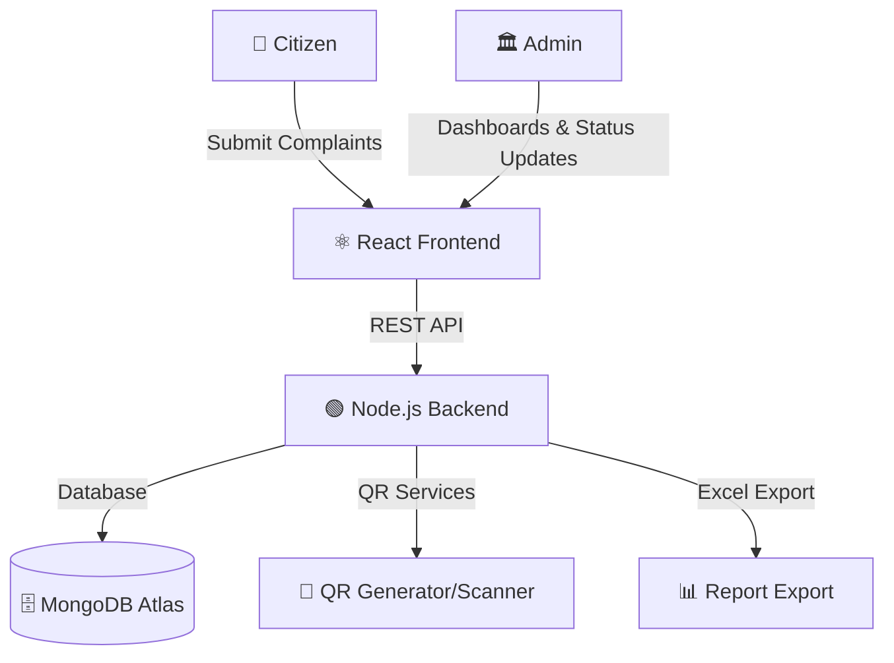
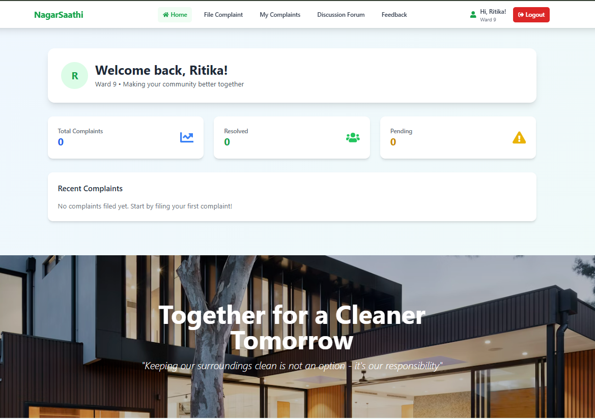
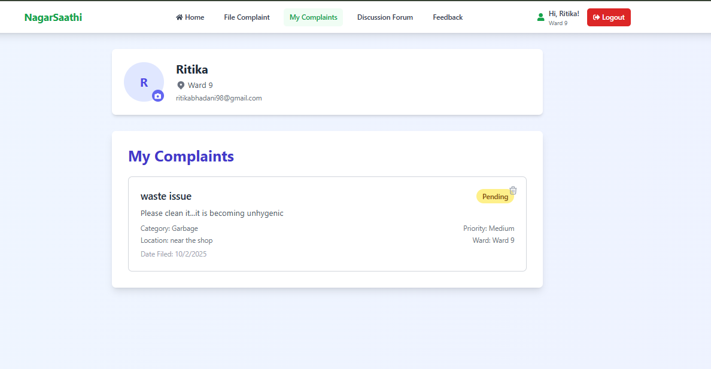
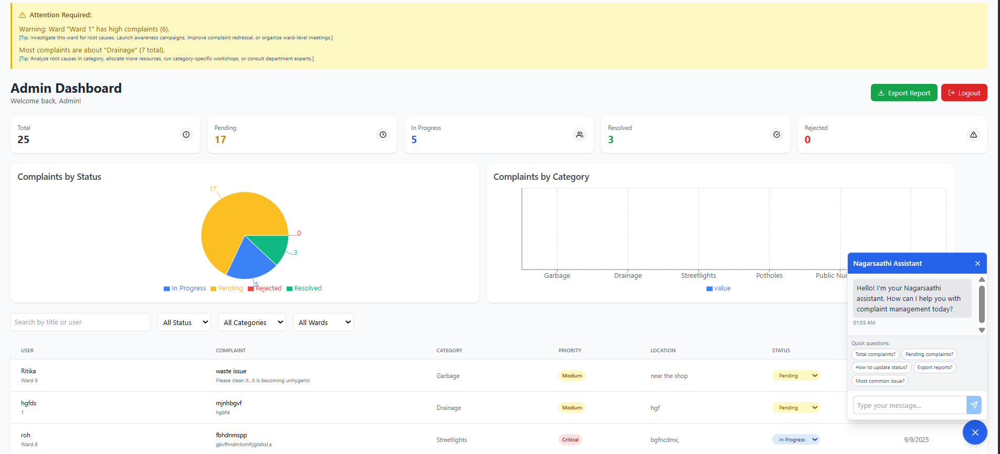
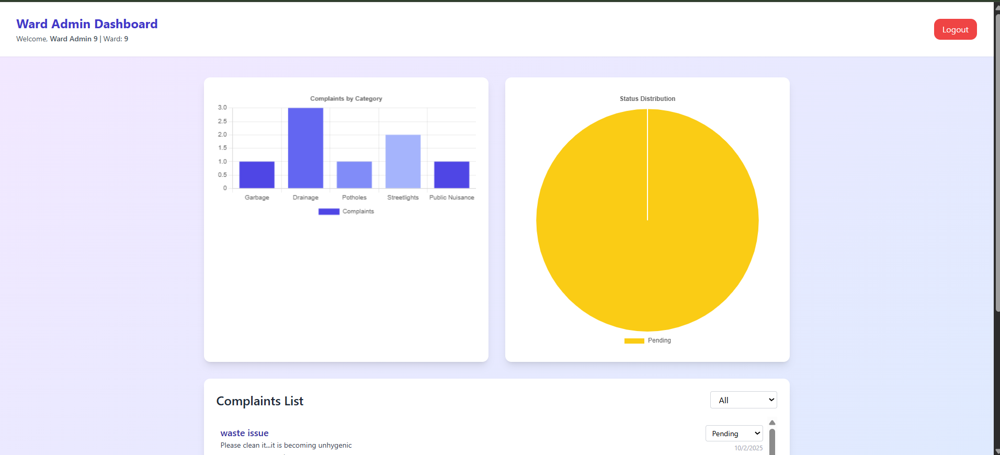
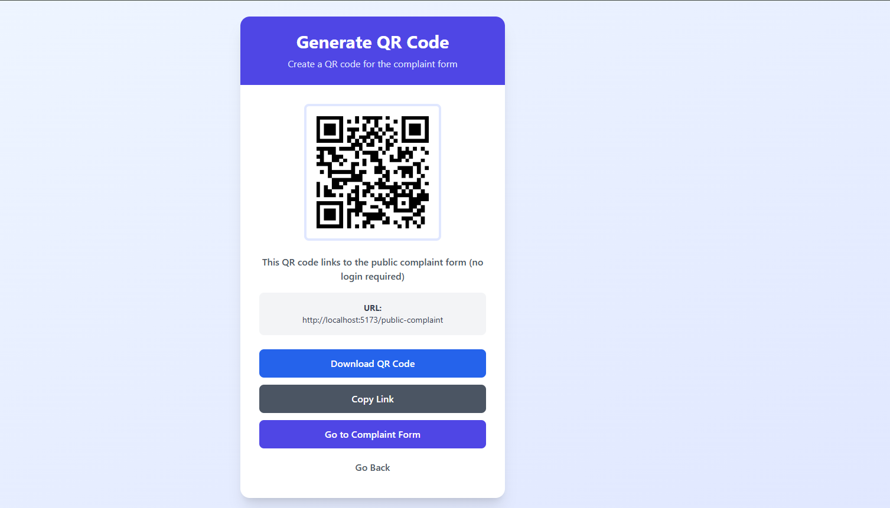
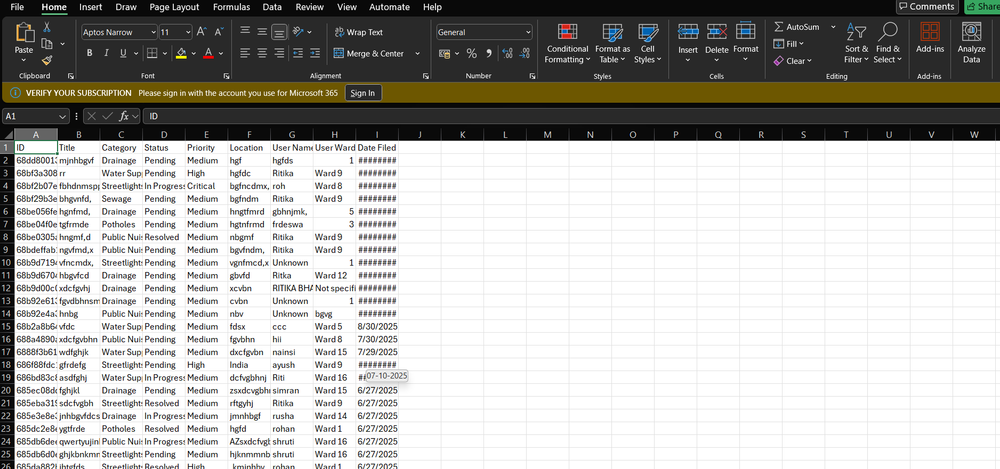

# 🏙️ NagarSaathi – Smart Municipal Grievance Management Platform

**A Smart Municipal Grievance Reporting & Management System**

---

## 📖 Introduction

**NagarSaathi** is a smart municipal grievance management platform that empowers citizens to seamlessly report civic issues like garbage, drainage, potholes, and streetlight failures. With real-time status tracking, data analytics, and ward-wise dashboards, it bridges the gap between the public and local authorities—ensuring faster resolution, improved transparency, and a cleaner, more responsive city.

### 🎯 Project Overview

- Citizen complaint reporting  
- Real-time status monitoring  
- Municipality dashboards  
- Ward-level management  
- QR-based complaint access  
- Complaint report downloads (Excel)  

---

## 🏗️ System Architecture

```mermaid
graph TD
    C[👥 Citizen] -->|Submit Complaints| F[⚛️ React Frontend]
    F -->|REST API| B[🟢 Node.js Backend]
    B -->|Database| D[(🗄️ MongoDB Atlas)]
    B -->|QR Services| Q[🔳 QR Generator/Scanner]
    B -->|Excel Export| X[📊 Report Export]
    A[🏛️ Admin] -->|Dashboards & Status Updates| F

```
## 📸 Project Screenshots

### Homepage

### Complaints Page

### Main Admin Dashboard

### Ward Admin Dashboard

### QR Functionality

### Complaints Excel Sheet

